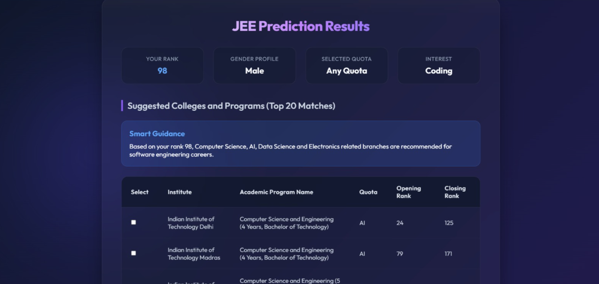

# JEE Smart College Advisor

## Preview



An intelligent JEE college prediction portal built using FastAPI.

## Features

- JEE Advanced and JEE Main prediction
- Gender-based filtering
- Home State / Other State quota filtering
- Interest-based recommendations
  - Coding
  - Research
  - MBA
- Smart Guidance System
- College Comparison Feature
- Admission Chance Analysis

## Tech Stack

- FastAPI
- Pandas
- Jinja2
- OpenPyXL
- HTML
- CSS
- JavaScript

## Live Demo

https://jee-rank-predictor-6jwn.onrender.com

## Dataset

JEE 2025 Official Cutoff Dataset

Source:
https://github.com/atmabodha/OpenNLP/blob/main/IIT-JEE/JEE_2025_Cutoffs.xlsx

## Algorithm Approach

The JEE Smart College Advisor follows the following pipeline:

1. User enters:
   - JEE Rank
   - Exam Type (JEE Main / Advanced)
   - Gender
   - Home State Quota
   - Career Interest

2. The application loads the official JEE 2025 cutoff dataset.

3. Based on the selected exam:
   - JEE Advanced → IITs are filtered.
   - JEE Main → NITs, IIITs and GFTIs are filtered.

4. Gender and quota filters are applied.

5. Career-interest filtering is performed:
   - Coding → Computer Science, AI, Data Science, IT related branches.
   - Research → Science and research-oriented branches.
   - MBA → Industrial, Mechanical, Management related branches.

6. Colleges whose closing rank satisfies the user's rank are selected.

7. Admission Chance is estimated using the rank and cutoff margin.

8. Smart Guidance provides personalized recommendations based on the student's career interest.

9. Users can compare multiple colleges side by side using the College Comparison feature.

## Run Locally

```bash
pip install -r requirements.txt
uvicorn main:app --reload
